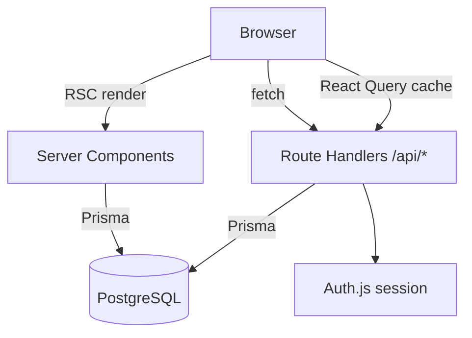
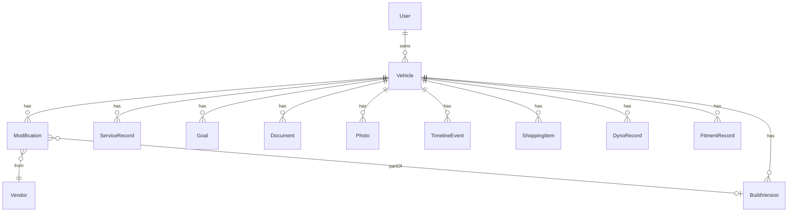

# Architecture — Garage Build Sheet

## 1. High-level overview

Garage Build Sheet is a Next.js 15 App Router application using React Server
Components for data-heavy reads and a thin REST layer (Route Handlers) for
client mutations. PostgreSQL is accessed through Prisma. Auth.js provides
authentication with a Credentials provider and JWT sessions.

### Rendering strategy

- **Reads**: Server Components query Prisma directly and pass serialized DTOs to
  client components. Data pages are `force-dynamic` (per-request).
- **Writes**: Client components call REST Route Handlers via React Query
  mutations, then invalidate the relevant query keys.
- **Local UI state**: Zustand stores (command palette, toasts).

## 2. Data model

The Prisma schema (`prisma/schema.prisma`) models the full domain:

| Domain            | Models                                                     |
| ----------------- | ---------------------------------------------------------- |
| Auth              | `User`, `Account`, `Session`, `VerificationToken`          |
| Core              | `Vehicle`, `Modification`, `Vendor`, `TimelineEvent`       |
| Ownership records | `ServiceRecord`, `Goal`, `Document`, `Photo`, `Album`      |
| Planning          | `ShoppingItem`, `BuildVersion`, `Budget`                   |
| Performance       | `DynoRecord`, `FitmentRecord`                               |
| Journaling        | `JournalEntry`, `Note`                                     |
| Social (future)   | `Follow`, `Like`, `Comment`                                |

Key enums: `ModCategory` (16 values), `ModStatus`, `CarArea`, `ServiceType`,
`DocumentType`, `ShoppingStatus`, `Priority`, `GoalStatus`, `TimelineEventType`.

## 3. API surface (MVP)

| Method | Route                        | Purpose                    |
| ------ | ---------------------------- | -------------------------- |
| GET    | `/api/vehicles`              | List current user vehicles |
| POST   | `/api/vehicles`              | Create vehicle             |
| GET    | `/api/vehicles/[id]`         | Get one vehicle            |
| PATCH  | `/api/vehicles/[id]`         | Update vehicle             |
| DELETE | `/api/vehicles/[id]`         | Delete vehicle             |
| GET    | `/api/modifications?vehicleId=` | List mods for a vehicle |
| POST   | `/api/modifications`         | Create mod (+ timeline event when installed) |
| PATCH  | `/api/modifications/[id]`    | Update mod / change status |
| DELETE | `/api/modifications/[id]`    | Delete mod                 |
| *      | `/api/auth/[...nextauth]`    | Auth.js handlers           |

Every handler authenticates via `requireUserId()` and enforces row-level
ownership. Bodies are validated with Zod (`src/lib/validation.ts`).

The same REST pattern extends to the remaining entities (service, goals,
documents, photos, shopping, dyno, fitment) — see the roadmap.

## 4. UI component structure

- `components/ui/*` — design-system primitives (Radix + CVA), themed to the
  industrial palette.
- `components/app-shell/*` — sidebar, topbar (with command palette + user menu),
  mobile bottom nav.
- `components/vehicles/*` — garage grid, add dialogs, and the vehicle-detail
  orchestrator.
- `components/vehicles/tabs/*` — one focused component per detail tab
  (overview, build sheet, diagram, timeline, analytics, gallery, service,
  shopping, goals, documents).
- `components/charts.tsx` — Recharts wrappers with shared theming.

## 5. State & data flow

1. Server Component loads data → serializes to DTO → passes to Client Component.
2. Client Component seeds React Query with `initialData` so there is no refetch
   flash, and re-fetches on mutation invalidation.
3. Mutations POST/PATCH/DELETE to `/api/*`, then invalidate query keys
   (`["vehicles"]`, `["mods", vehicleId]`).

## 6. Auth

- Auth.js v5 with `PrismaAdapter` + `Credentials` provider.
- JWT session strategy (required for Credentials); the user id is threaded into
  the token and session.
- `getCurrentUserId()` returns the session user, with a **dev-only** demo
  fallback so the app is browsable without signing in.

## 7. Extensibility for social features

Social models (`Follow`, `Like`, `Comment`) and `Vehicle.isPublic` /
`Vehicle.publicSlug` are already in the schema so public build pages, likes,
comments and followers can be layered on without a migration of existing data.
No social UI is implemented yet — this is deliberate architectural preparation.
